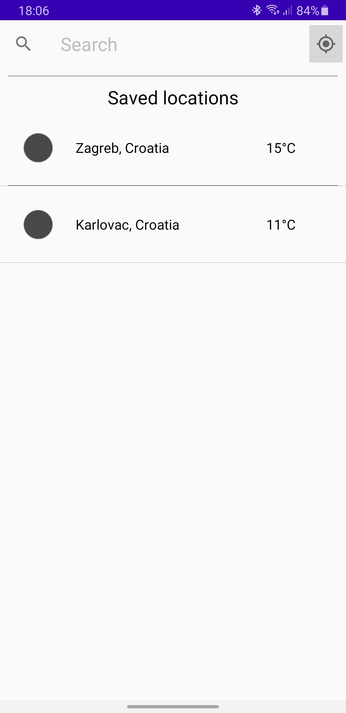
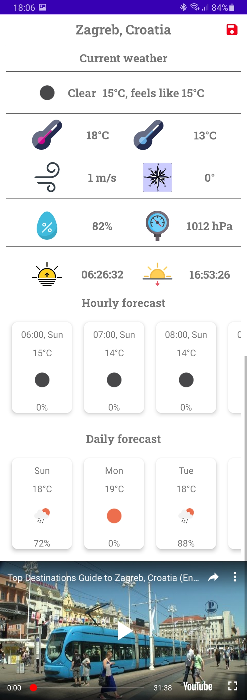

# Bornfight-Weather-App

This is a simple weather app created as a result of an interview task at Bornfight. 

The app utilizes the google Places API for searching locations or the users own location to access the current
and forecast weather via the openweathermap API. 
It also uses the YouTube player via the YouTube data API to show a relevant video of the location/current weather.  

<h2>Search and saved locations</h2>

<h2>Current weather and forecast</h2>

